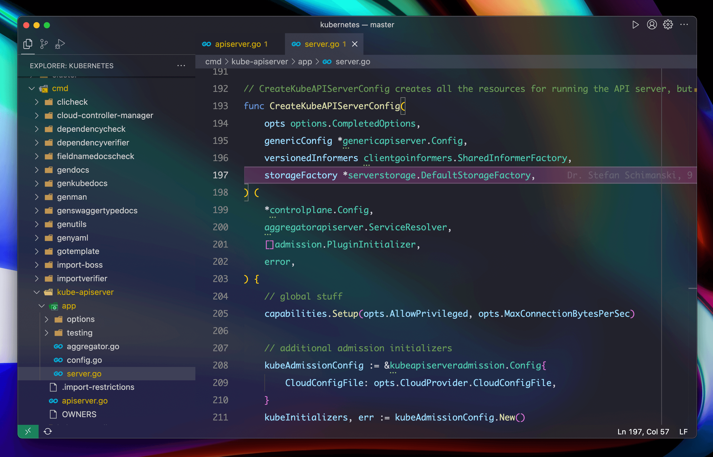

# VSCode Settings

## Font

`"editor.fontFamily": "Monaco, Consolas"`

- Macos: `Monaco`
- Windows: `Consolas`

## Themes/Color

- [Vibrancy Continued](https://github.com/illixion/vscode-vibrancy-continued)
  - `"vscode_vibrancy.theme": "Catppuccin Mocha"`
  - `"workbench.colorTheme": "Default Dark+"`

## User Settings

Principle：Keep it simple and efficient

[settings.json](./settings.json)

## Extensions

[code-extensions.txt](./code-extensions.txt)

**Export & Install**

- Export：`code --list-extensions > code-extensions.txt`
- Install：`cat code-extensions.txt | xargs -L 1 code --install-extension`

**Others**

- 无限试用 [GitLens](https://github.com/gitkraken/vscode-gitlens) 的 [方案](https://zhuanlan.zhihu.com/p/675238420)

## Keyboard Shortcuts

**Key Mappings**

|               | Mac  | Windows |
| ------------- | ---- | ------- |
| Main Key      | Cmd  | Ctrl    |
| Secondary Key | Ctrl | Alt     |

**Keyboard Shortcuts Mappings**

- [Macos](./keybindings/macos/keybindings.json)
- [Windows](./keybindings/macos/keybindings.json)
