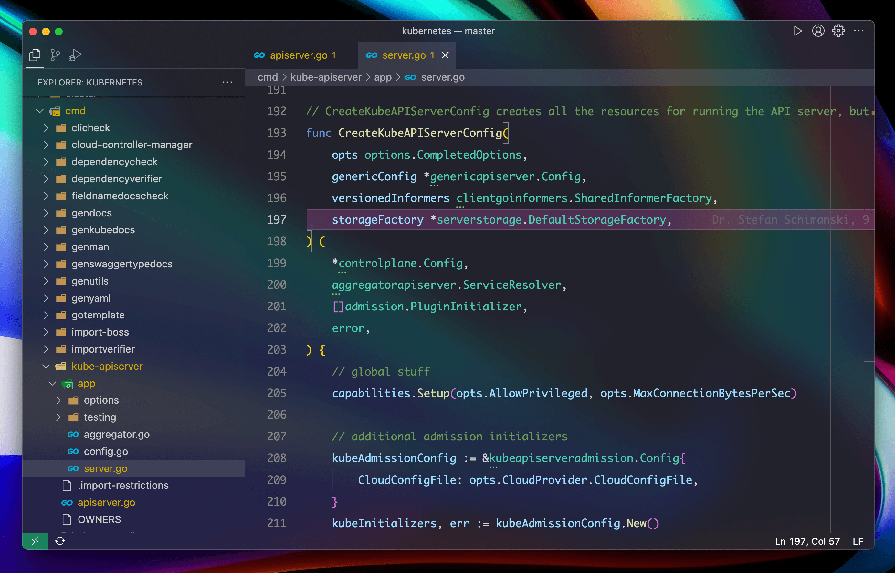

# VSCode Settings


个人 VSCode 配置，跨 macOS / Windows 同步使用。

> 原则：**Keep it simple and efficient** —— 贴近 JetBrains / Spacemacs 的键位习惯，少依赖、高复用。



---

## 文件清单

| 文件 | 说明 | VSCode 对应位置 |
| --- | --- | --- |
| [settings.json](./settings.json) | 用户设置 | `User/settings.json` |
| [keybindings.mac.json](./keybindings.mac.json) | macOS 快捷键 | `User/keybindings.json` |
| [keybindings.win.json](./keybindings.win.json) | Windows 快捷键 | `User/keybindings.json` |
| [snippets.go.json](./snippets.go.json) | Go 代码片段（18） | `User/snippets/go.json` |
| [snippets.md.json](./snippets.md.json) | Markdown 代码片段（11） | `User/snippets/markdown.json` |
| [code-extensions.txt](./code-extensions.txt) | 扩展列表（38） | — |

**VSCode 配置目录：**

- macOS：`~/Library/Application Support/Code/User/`
- Windows：`%APPDATA%\Code\User\`
- Linux：`~/.config/Code/User/`

---

## 字体

| 平台 | 字体 |
| --- | --- |
| macOS | `Monaco` |
| Windows | `Consolas` |

## 主题与配色

- 颜色主题：`Default Dark+`
- **状态栏按场景变色**：正常编码 = 骚粉、无项目 = 紫、Debug 中 = 橙、远程环境 = 绿
- 可选毛玻璃增强（macOS）：[Vibrancy Continued](https://github.com/illixion/vscode-vibrancy-continued)
  - `vscode_vibrancy.theme: "Catppuccin Mocha"`

---

## 快捷键设计

采用 **Spacemacs 风格的 leader key**，减少修饰键组合：

| Leader | 用途 | 示例 |
| --- | --- | --- |
| `cmd + 数字` | 切换面板 | `cmd+1` 侧栏、`cmd+2` 面板、`cmd+3` AI 侧栏 |
| `ctrl + 数字` | Git 操作 | `ctrl+1` diff、`ctrl+2` graph、`ctrl+3` blame |
| `ctrl+g` | LSP 跳转 | `ctrl+g ctrl+d` 跳定义、`ctrl+g ctrl+r` 引用 |
| `ctrl+s` | 分屏 | `ctrl+s ctrl+v` 右分屏、`ctrl+s ctrl+h` 下分屏 |

**跨平台键位映射：**

| | Mac | Windows |
| --- | --- | --- |
| 主键 | `Cmd` | `Ctrl` |
| 副键 | `Ctrl` | `Alt` |

详见 [keybindings.mac.json](./keybindings.mac.json) / [keybindings.win.json](./keybindings.win.json)。

---

## 代码片段

- **Go**（18）：`pkgm` `main` `init` `fn` `recv` `handler` `type` `iface` `forr` `fori` `switch` `select` `go` `errnil` `errp` `test` `bench` `ignoremain`
- **Markdown**（11）：`tb` `trow` `code` `quote` `link` `img` `badge` `task` `hr` `details` `cmt`

---

## 扩展

共 38 个，详见 [code-extensions.txt](./code-extensions.txt)。核心包括：

GitLens · Git Graph · git-log--graph · Periscope · Claude Code · GitHub Copilot · Prettier · ESLint · Go · Python (Pylance + Black) · Solidity (Hardhat) · vscode-icons · Code Spell Checker · Remote SSH

**导出 / 安装：**

```bash
# 导出
code --list-extensions > code-extensions.txt

# 安装（macOS / Linux）
cat code-extensions.txt | xargs -L 1 code --install-extension

# 安装（Windows PowerShell）
Get-Content code-extensions.txt | ForEach-Object { code --install-extension $_ }
```

---

## 其他

- 无限试用 [GitLens](https://github.com/gitkraken/vscode-gitlens) 的[方案](https://zhuanlan.zhihu.com/p/675238420)
